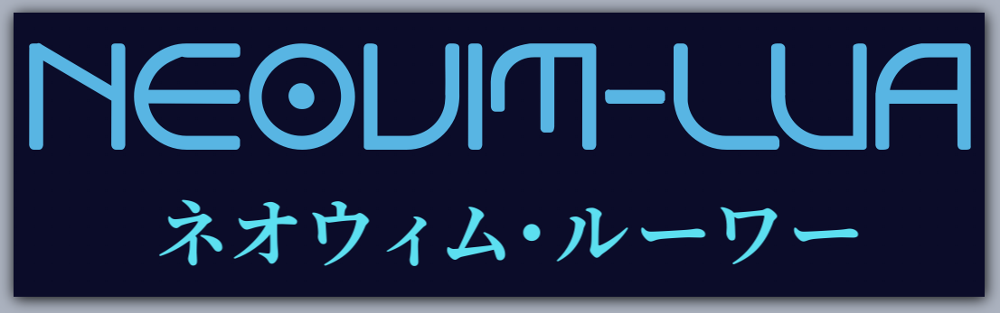
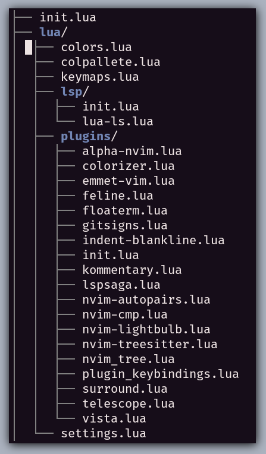
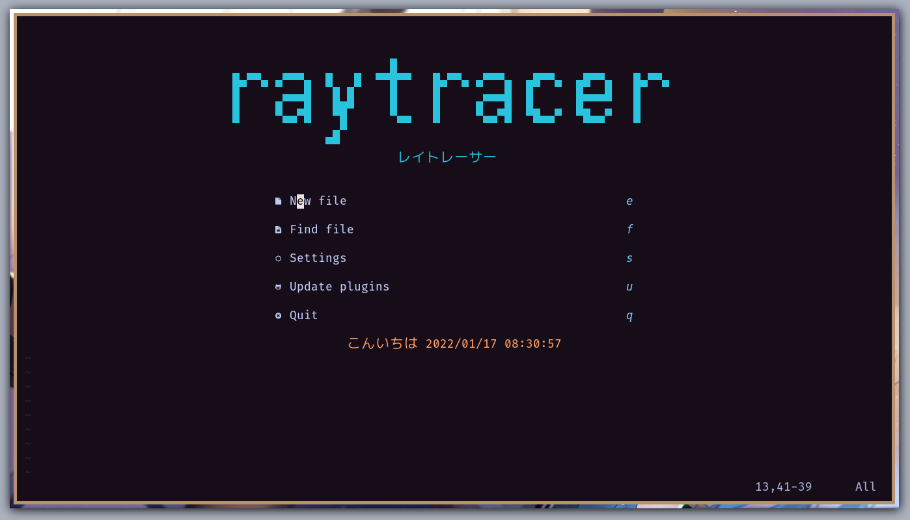
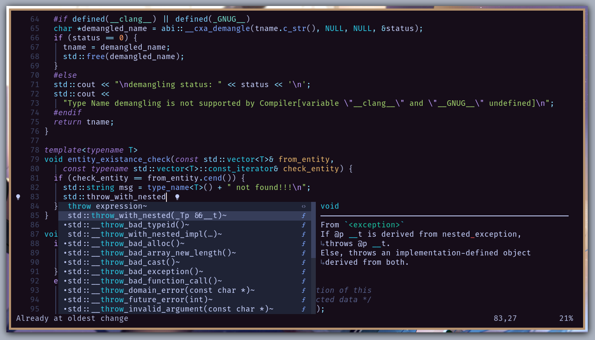

  

<h2>
  My Neovim-Lua Configuration
</h2>

<h3>
  Advantages
</h3>
<ul>
  <li>Fast Startup</li>
  <li>Better Configuration</li>
  <li>Native LSP support</li>
</ul>

## Directory Structure

For `language server` build files you can create a directory name **language-servers** and put the configuration of `language servers` in their individual folders.

Like `sumneko-lua` and `jdtls` require such configuration.

* **init:** `init.lua` contains all the main modules required.

* **Plugins:** All the installed are in `lua/plugins/init.lua` and their configuration is stored in their respective files inside `lua/plugins`.

* **Keybindings:** _General_ keybinds are stored in `lua/keymaps.lua` and _plugin specific_ keybindings are stored in `lua/plugins/plugin_keybindings.lua`.

* **Settings:** _General_ settings are stored in `lua/settings.lua` and _plugin specific_ as mentioned before are stored in `lua/plugins`.

* **Colors:** Color configuration, both _general_ and _plugin's variables_ are setup in `lua/colors.lua` file. _General_ highlight group overrides are provided in `lua/colors.lua`, while _plugin specific_ highlight groups are stored in their individual configuration files. This is the only reason for putting `plugin` module after `colors` in `init.lua`.

* _colpallete.lua_ file contains custom color palletes which can be used by plugins by loading individually in their configuration file.

* **LSP:** All the `LSP` related stuff are in `lua/lsp/init.lua`. Note that _completion_ and other _LSP related_ plugin's configuration are in their configuration files in `lua/plugins` directory.

## Plugins Used

You can find all the installed in `lua/plugins/init.lua`. I'm mentioning some important ones.

### LSP & Completion

* neovim/nvim-lspconfig
* glepnir/lspsaga.nvim
* onsails/lspkind-nvim
* kosayoda/nvim-lightbulb'
* mfussenegger/nvim-jdtls

* hrsh7th/nvim-cmp
* hrsh7th/cmp-nvim-lsp
* hrsh7th/cmp-path
* hrsh7th/cmp-buffer
* saadparwaiz1/cmp_luasnip

### Statusline

* famiu/feline.nvim

### Utils

* nvim-telescope/telescope.nvim
* nvim-treesitter/nvim-treesitter
* lukas-reineke/indent-blankline.nvim
* christoomey/vim-tmux-navigator
* voldikss/vim-floaterm

### trees

* kyazdani42/nvim-tree.lua
* liuchengxu/vista.vim

### icons

* kyazdani42/nvim-web-devicons

### git

* lewis6991/gitsigns.nvim

### text commentary

* b3nj5m1n/kommentary

### text align

* godlygeek/tabular

### text surround

* blackCauldron7/surround.nvim

### colors

* tanvirtin/monokai.nvim
* ayu-theme/ayu-vim
* romgrk/doom-one.vim
* cocopon/iceberg.vim
* whatyouhide/vim-gotham
* srcery-colors/srcery-vim
* sainnhe/gruvbox-material
* jacoborus/tender.vim
* jnurmine/Zenburn
* sainnhe/edge
* folke/tokyonight.nvim
* arzg/vim-colors-xcode
* norcalli/nvim-colorizer.lua
* yunlingz/equinusocio-material.vim
* ChristianChiarulli/nvcode-color-schemes.vim
* bluz71/vim-nightfly-guicolors
* rose-pine/neovim

## Screenshots

* **Start**

* **LSP**

## Credits

### Videos

Checkout [chrisatmachine](https://www.youtube.com/c/ChrisAtMachine). He has good vidoes for different plugins and lua based neovim setup.

### Blogs & Sites

* [configure neovim using lua](https://dev.to/vonheikemen/everything-you-need-to-know-to-configure-neovim-using-lua-3h58)

* [chrisatmachine](https://www.chrisatmachine.com/)

### repos

* [nvim lua guide](https://github.com/nanotee/nvim-lua-guide)

* [brainfucksec/neovim-lua](https://github.com/brainfucksec/neovim-lua)

* [LunarVim/Neovim-from-scratch](https://github.com/LunarVim/Neovim-from-scratch)

## Disclaimer

This is not one step installation method repo. You are free to take anything and everything you see here to use in your own configuration. . This repo is under constant development stage. I try to follow minimal approach i.e., `KISS` principle. So, I'm adding and removing things according to my need.

---

#### Thanks to the authors of sites/blogs and repos and content creators mentioned above for creating awesome materials.
